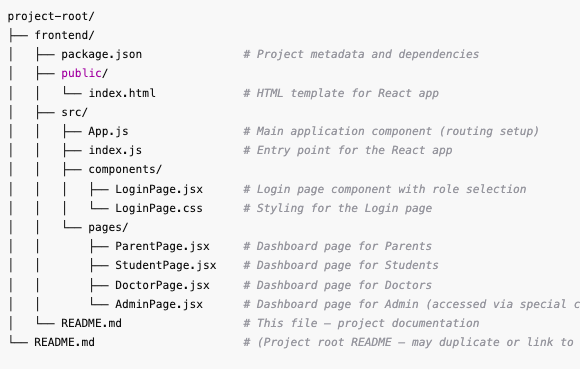

# Therapy Appointment Scheduler - Frontend

## Table of Contents
- [Project Overview](#project-overview)
- [Features](#features)
- [File Structure](#file-structure)
- [Default Credentials](#default-credentials)
- [Installation and Setup](#installation-and-setup)
- [Usage](#usage)
- [Future Enhancements](#future-enhancements)
- [License](#license)
- [Contact](#contact)

---

## Project Overview

### Introduction
This project is a web-based **Therapy Appointment Scheduler** designed to assist:
- **Parents** who can manage appointments for their children,
- **Students** who may also schedule or view their sessions,
- **Doctors** who can set availability and manage bookings,
- **Admin** who has elevated privileges to manage system-wide settings.

The application includes:
- A **role-based login system** with default credentials.
- Navigation using **React Router** to load specific dashboards.
- A clean, responsive UI that centers on simplicity and clarity.

---

## Features

### Role-Based Login
- Users may select **Parents**, **Students**, or **Doctors** from a dropdown.
- A special **Admin** login is handled with a hardcoded username and password.

### Default Credentials
- Predefined username and password combinations for each role (Parents, Students, Doctors, Admin).

### Form Validation
- Basic checks ensure non-empty username and password fields.
- Displays error messages for incorrect credentials.

### React Router Navigation
- `react-router-dom` handles routing to the respective pages.

### Responsive UI
- A straightforward login form with role selection and clear styling.

---

## File Structure

- Below is the rough file directory structure:
**Figure 1:** A diagram showing the project's frontend file structure



## Installation and Setup

### Prerequisites
- [Node.js](https://nodejs.org/) (version 14 or above)
- npm (installed with Node.js)

### Steps

1. **Clone the Repository**
   ```bash
   git clone <repository-url>
   cd frontend 