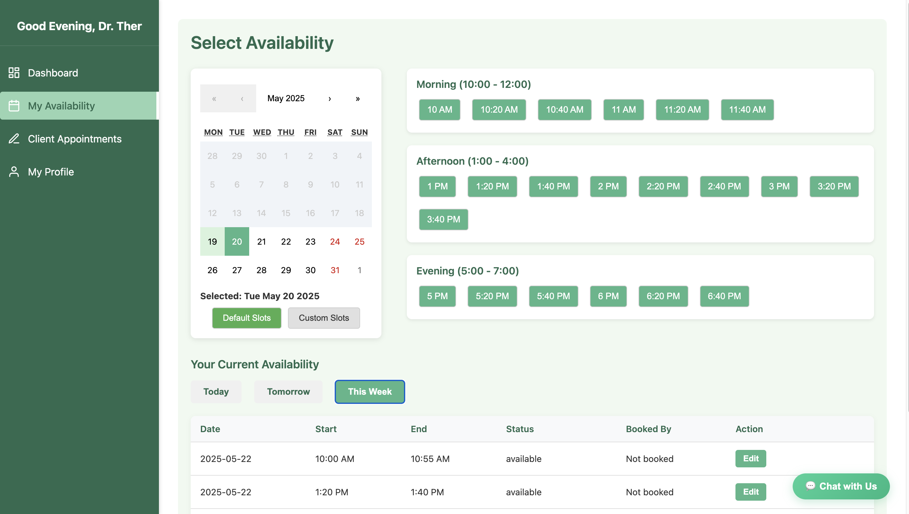
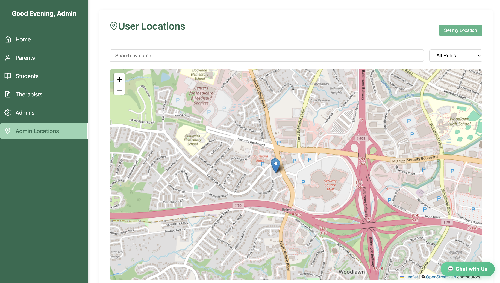
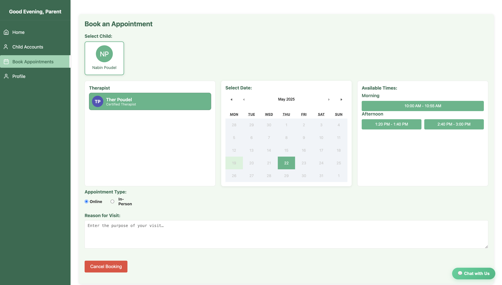
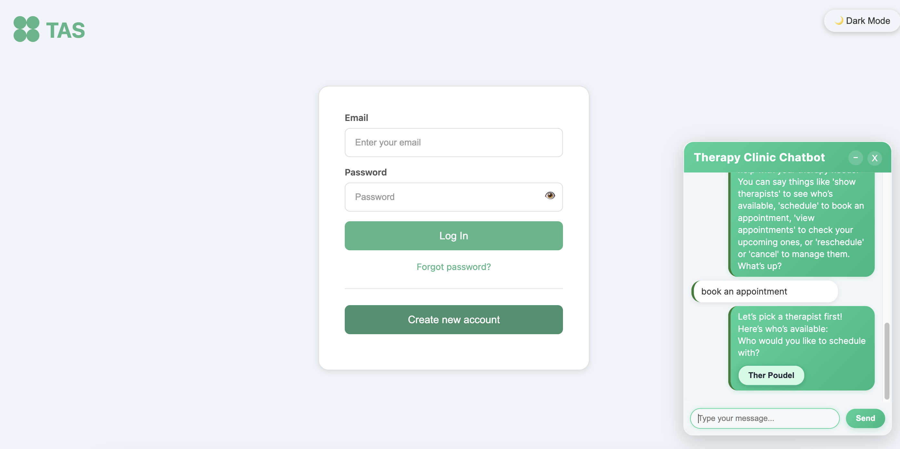
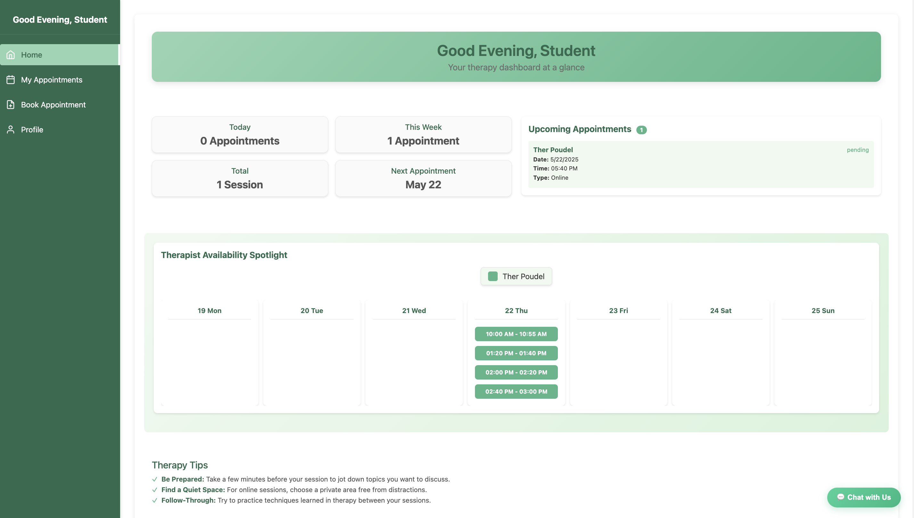

# Therapy Appointment Scheduler – Full Stack

## Table of Contents

* [Project Overview](#project-overview)
* [Screenshots](#screenshots)
* [Features](#features)
* [Tech Stack](#tech-stack)
* [Backend Dependencies](#backend-dependencies)
* [Frontend Dependencies](#frontend-dependencies)
* [Database Structure](#database-structure)
* [File Structure](#file-structure)
* [Default Credentials](#default-credentials)
* [Installation and Setup](#installation-and-setup)

  * [Prerequisites](#prerequisites)
  * [Database Setup](#database-setup)
  * [Backend Setup](#backend-setup)
  * [Frontend Setup](#frontend-setup)
* [Environment Variables & Security](#environment-variables--security)
* [Running the Application](#running-the-application)
* [Navigating the Application](#navigating-the-application)
* [API Documentation](#api-documentation)
* [User Guides](#user-guides)
* [Contributing](#contributing)
* [Troubleshooting](#troubleshooting)
* [Credits & License](#credits--license)

---

## Project Overview

The Therapy Appointment Scheduler is a robust, user-friendly web app for clinics and educational institutions. It allows parents, students, therapists, and admins to coordinate therapy appointments efficiently. Features include:

* **Role-based dashboards**
* **Natural language chatbot**
* **Email notifications**
* **Secure authentication**
* **Modern UI**

---

## Screenshots

Store all screenshots in the `images/` folder.
Replace the placeholders below with your actual screenshots and descriptions.

### 1. Therapist: Availability Setting Page


*Therapists can specify available days and times for appointments.*

### 2. Location in Admin Page


*Users can update their location, visible to Admins.*

### 3. Parent: Appointment Booking Page


*Parents select a child, choose a therapist, and book appointments using a guided flow.*

### 4. Chatbot Interaction Page


*Chatbot interface allows users to book, reschedule, or cancel appointments using simple language.*

### 5. Student Dashboard


*Students view and manage their upcoming therapy sessions.*

*(Add or rename screenshots as needed. Update file paths as you add more.)*

---

## Features

* **Registration & Login:** Distinct flows for Parent, Student, Therapist. Admins are pre-configured in the database.
* **JWT Authentication:** Secure login, with tokens issued on authentication.
* **Appointment Management:** Schedule, reschedule, or cancel via dashboard or chatbot.
* **Therapist Availability:** Therapists set weekly availability, editable anytime.
* **Calendar View:** Parents and students can see upcoming and past appointments.
* **Email Alerts:** Get notified for new appointments and changes.
* **Chatbot:** Use natural language to manage appointments.
* **Admin Panel:** Full system/user management.
* **Responsive Design:** Works on desktop and mobile.

---

## Tech Stack

* **Frontend:** React.js (with CSS modules)
* **Backend:** Flask (Python)
* **Database:** MySQL
* **Authentication:** JWT (Flask-JWT-Extended)
* **AI/NLP:** spaCy + English language model
* **Other:** Flask-Bcrypt, Flask-CORS, MySQL Connector, Email (via SMTP)

---

## Backend Dependencies

Add these lines to `backend/requirements.txt`:

```txt
Flask
Flask-CORS
Flask-Bcrypt
Flask-JWT-Extended
mysql-connector-python
python-dateutil
spacy
```

**Install spaCy model:**

```bash
python -m spacy download en_core_web_sm
```

---

## Frontend Dependencies

Your main frontend dependencies are managed via `frontend/package.json`.
Key libraries:

* `react`
* `react-dom`
* `react-router-dom`
* `jwt-decode`
* (Install with `npm install`)

---

## Database Structure

Tables:

* `ADMIN` – Admins (pre-configured)
* `USERS` – Authentication/role
* `STUDENT` – Student info
* `PARENT` – Parent info
* `THERAPIST` – Therapist info
* `APPOINTMENTS` – All bookings
* `AVAILABILITY` – Therapist available slots
* `GUARDIAN` – Parent-student link

Run the schema with the provided `database/therapy_clinic.sql`.

---

## File Structure

```
GROUP_PROJECT/
│
├── backend/
│   ├── app.py
│   ├── requirements.txt
│   ├── routes/
│   │   ├── adminRoute/
│   │   ├── authenticationRoute/
│   │   ├── chatBotRoute/
│   │   ├── parentRoute/
│   │   ├── studentRoute/
│   │   └── therapistRoute/
│   ├── utils/
│   └── .env (dummy)
│
├── database/
│   ├── therapy_clinic.sql
│
├── frontend/
│   ├── src/
│   │   ├── components/
│   │   └── pages/
│   │       ├── AdminPage/
│   │       ├── ChatBot/
│   │       ├── LoginPage/
│   │       ├── ParentPage/
│   │       ├── StudentPage/
│   │       └── TherapistPage/
│   ├── package.json
│
├── images/
│   └── (All screenshots go here)
```

---

## Default Credentials

| Role  | Username | Password |
| ----- | -------- | -------- |
| Admin | Admin    | (see DB) |

* **Admin password is hashed. Change it after first login.**

---

## Installation and Setup

### Cloning the Repository

First, clone the repository from GitHub to your local machine:

```bash
git clone https://github.com/nubpz/Group4.git
cd Group4
```

### Prerequisites

* [Node.js v14+](https://nodejs.org/)
* npm (comes with Node.js)
* [Python 3.8+](https://python.org/)
* [MySQL 8.0+](https://dev.mysql.com/)
* [Git](https://git-scm.com/)

---

### Database Setup
## Setting the Initial Admin Password

> **IMPORTANT:**
> For security, the admin password is stored as a hashed value in the database.
> You must generate a secure hashed password for the admin account **before first login**.

**To generate a hash using Python and Flask-Bcrypt:**

1. Open a Python shell:

   ```bash
   python
   ```

2. Run the following:

   ```python
   from flask_bcrypt import Bcrypt
   bcrypt = Bcrypt()
   hash = bcrypt.generate_password_hash("your_new_admin_password").decode('utf-8')
   print(hash)
   ```

   Replace `"your_new_admin_password"` with the password you want for the admin account.

3. Copy the output hash.

4. Log in to MySQL and update the admin user's password:

   ```sql
   UPDATE USERS SET password = 'paste_the_hash_here' WHERE username = 'Admin';
   ```

   *(Make sure the username matches your admin user)*

**RUN DATABASE**
1. **Start MySQL.**
2. **In a terminal:**

   ```bash
   mysql -u root -p
   ```
3. **Inside MySQL:**

   ```sql
   CREATE DATABASE therapy_clinic;
   USE therapy_clinic;
   SOURCE /path/to/database/therapy_clinic.sql;
   ```


---

### Backend Setup

1. **Go to backend folder:**

   ```bash
   cd backend
   ```
2. **Install dependencies:**

   ```bash
   pip install -r requirements.txt
   ```
3. **Install spaCy model:**

   ```bash
   python -m spacy download en_core_web_sm
   ```
4. **Email Environment Variables:**
   Create `.env` file in `backend/`:

   ```env
   EMAIL_USER=your_email@gmail.com
   EMAIL_PASS=your_gmail_app_password
   ```

   * [Generate an app password with Gmail](https://support.google.com/accounts/answer/185833).
   
5. **No need to set DB credentials in `.env` (they are hardcoded in `app.py`).**

---

### Frontend Setup

1. **Go to frontend folder:**

   ```bash
   cd ../frontend
   ```
2. **Install frontend dependencies:**

   ```bash
   npm install
   ```
3. **(Optional) Set backend API URL:**
   If your backend URL changes, create `.env`:

   ```env
   REACT_APP_API_URL=http://localhost:5000
   ```

---

## Environment Variables & Security

* **Never commit sensitive files:**
  `.env` should be in your `.gitignore`.
  Only share `.env.example` (with placeholders) if needed.
* **Using Gmail app password:**
  Visit your Google account settings to generate a secure app password for email sending.
* **Reference in Python code:**

  ```python
  import os
  EMAIL_USER = os.getenv('EMAIL_USER')
  EMAIL_PASS = os.getenv('EMAIL_PASS')
  ```

---

## Running the Application

### 1. **Start MySQL service.**

### 2. **Start backend (Flask):**

```bash
cd backend
python app.py
```

* Backend will run at: [http://localhost:5000](http://localhost:5000)

### 3. **Start frontend (React):**

```bash
cd frontend
npm start
```

* Frontend will run at: [http://localhost:3000](http://localhost:3000)

---

## Navigating the Application

* **Login Page:** Choose user type, enter credentials.
* **Dashboard:**

  * Parent: See/select children, book or manage appointments.
  * Student: View/book appointments.
  * Therapist: Set availability, see bookings, update status.
  * Admin: Full management interface.
* **Chatbot:** Accessible from dashboard; use natural language (e.g., "Book with Dr. Smith next Tuesday").
* **Email Alerts:** Sent for appointment confirmations and changes.

---

## API Documentation

* `POST /api/auth/login` — Login, receive JWT

* `POST /api/auth/register` — Register new account

* `GET /api/parents/appointments` — List appointments for children

* `POST /api/parents/appointments` — Book new appointment

* `GET /api/students/appointments` — List student’s appointments

* `POST /api/students/appointments` — Book as student

* `GET /api/therapists/availability` — Therapist views/sets slots

* `POST /api/therapists/availability` — Update availability

* `GET /api/therapists/appointments` — Therapist’s appointments

* `GET /api/admin/users` — All users (admin only)

* `POST /api/admin/users` — Create user (admin only)

* `PUT /api/admin/users/:id` — Update user

* `DELETE /api/admin/users/:id` — Delete user

* **Chatbot endpoints:**

  * `/chatbot/start`
  * `/chatbot/interact`

(See backend route files for all parameters and request/response examples.)

---

## User Guides

### Parent

* Log in, select a child, view and book appointments.
* Manage/cancel bookings.
* Use the chatbot for quick scheduling.

### Student

* Log in, see upcoming sessions, book/cancel appointments.
* Check notifications for changes.

### Therapist

* Set/update your available days and times.
* View your appointments for the week.
* Change appointment status (completed/cancelled).
* Update location for in-person visits.

### Admin

* Manage all users, appointments, therapist info.
* View full clinic statistics and system logs.

### Chatbot

* Click the chatbot icon.
* Type sentences like:

  * “Book with Dr. Smith next Friday”
  * “Cancel my appointment on June 10”
  * “Reschedule my next session”
* The chatbot will guide you step by step.

---

## Contributing

1. Fork this repo
2. Create a branch: `git checkout -b feature/my-feature`
3. Make changes, commit: `git commit -am "Describe your feature"`
4. Push: `git push origin feature/my-feature`
5. Open a pull request with a summary of your changes

---

## Troubleshooting

### Backend not starting?

* Ensure Python 3.8+ is installed
* All pip dependencies installed
* MySQL is running, schema loaded

### Frontend not starting?

* Try deleting `node_modules` and run `npm install` again
* Clear npm cache: `npm cache clean --force`

### Database connection issues?

* Check your DB is running and schema matches your models

### Email not sending?

* Check `.env` exists and uses correct Gmail app password
* Make sure less secure app access is enabled for your Google account (if needed)

### Chatbot errors?

* Ensure you ran `python -m spacy download en_core_web_sm`
* Check backend logs for NLP/model errors

**For other issues:**

* Open an Issue on GitHub with details, logs, and screenshots.

---

## Credits & License

© 2023–2025 Therapy Appointment Scheduler Team – Group 4
This project is open source for educational use.

---
